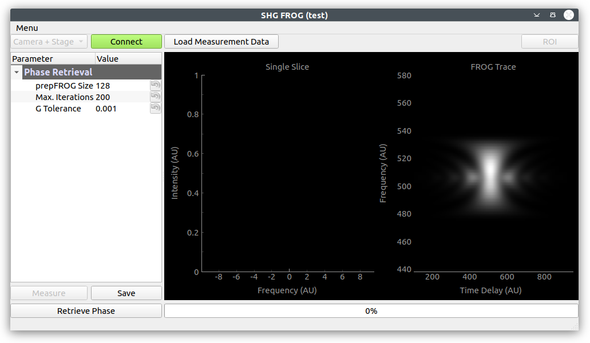
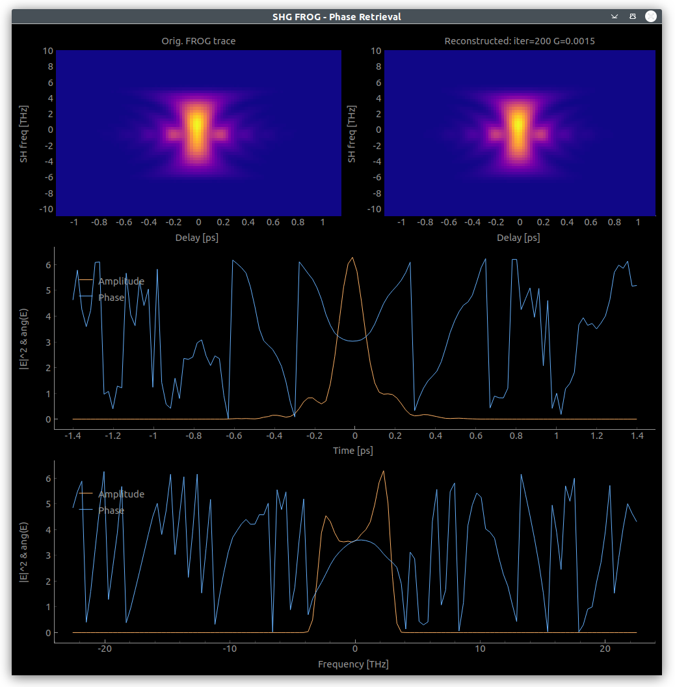

# shg_frog

[](https://github.com/jkrauth/shg_frog/blob/main/LICENSE)

Software for measurement and characterization of ultra-fast laser pulses using the __SHG FROG__ technique.

> Want to know more about FROG?
> R. Trebino, Frequency-Resolved Optical Gating: the Measurement of Ultrashort Laser Pulses, Kluwer, Boston (2002)

Commercial devices exist, but are rather expensive. A home-built device can save a lot of money.
The code in this repository provides:

* A graphical user interface for the measurement of the so-called FROG trace.
* The possibility to choose between two different phase retrieval algorithms:
  * GP (generalized projections) phase retrieval algorithm (see [Kane, 1999](https://ieeexplore.ieee.org/abstract/document/753647)). The code used here is based on the [Matlab package](https://nl.mathworks.com/matlabcentral/fileexchange/34986-frequency-resolved-optical-gating-frog) by Steven Byrnes.
  * Ptychographic reconstruction algorithm (see [Sidorenko et al., 2016](https://www.osapublishing.org/optica/fulltext.cfm?uri=optica-3-12-1320&id=354383)). The code used here is based on the [Matlab package](https://oren.net.technion.ac.il/homepage/) by the same authors.
* A list of possible hardware components that integrate nicely with this software. But also alternative devices can be used and easily integrated.

The main window:



The phase retrieval window:



## Setting up

### Software dependencies

* Python version = 3.7

* most of the dependencies (pyqt5, pyqtgraph, pyyaml, matplotlib, imageio) are installed automatically with the pip command. Additionally you need to install
  * [Vimba SDK](https://www.alliedvision.com/en/products/software.html) from Allied Vision
* QtDesigner, in case you want to modify the GUI

### Download and start

Install the FROG software (ideally in a virtual python environment) by

```console
pip install git+https://github.com:jkrauth/shg_frog.git
```

Run it by

```console
shg_frog [-h]
```

with '-h' to see available options.

After you started the software once, you will have a `.frog_config` folder in your home directory. It contains a `config.yml` file that should be adapted to your setup.

Measurement data will be saved into a `frog_data`folder, also in your home directory.

Upon startup you will have example data loaded which you can use for a first pulse reconstruction. This is overwritten as soon as you do a measurement.

### Notes on Terminology and Parameter options 
**Phase Retrieval**

* The GP algorithm gives generally better results with a lower error (G in the phase retrieval GUI). In some cases, however, it does not converge. In these cases the ptychographic algorithm provides a  solution. 
* The "prepFrog" parameter should be 128 unless modifications to the Phase Retrieval GUI are made. 

**Stage**

* Offset refers to the stage position (i.e. mirror position) at which the FROG signal is maximum and is the point around which the FROG trace is measured, over a range specified by "Number of steps" and "Step size". 


### Hardware

#### Newport Stage

* The best and cheapest solution to get a motorized translation stage in our case was to buy an
  actuator (Newport TRA25-CC) and combine it with an existing manual stage. The stage can be controlled via the Newport SMC100-CC controller.
* The minimum incremental motion of the above mentioned device is 0.2 micron. For laser pulses with a pulse length of <=20 fs a better actuator might be considered. For ~200 fs pulses it works fine.
* A driver for that setup is included in the labdevices package (see requirements).

#### Spectrometer

* We use the Allied Vision Manta G235B camera in combination with a grating. Other Allied Vision Manta GigE cameras should also work.

* Trigger the camera externally if the laser has a low repetition rate (e.g. 30Hz).
  External trigger (TTL) has to be at least 6 microseconds long with an amplitude of min. 2V.
  More information on triggering the camera is found in the Manta Tech Manual from page 193 on.

* **Currently not fully implemented**: There is also an option to measure with a Spectrometer for comparison. In our case we used the ANDO Spectrometer AQ-6315A in combination with a prologix-gpib-ethernet adapter. This option is not ideal because the measurements take much more time which you might want to avoid if your laser is not too stable. Still, for calibration it might be useful.

* The driver for camera and spectrometer is included in the labdevices package (see requirements).
