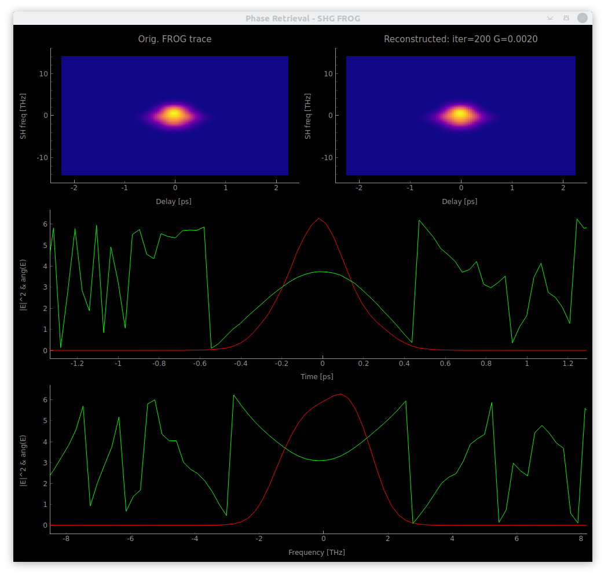

# shg_frog

Software for measurement and characterization of ultra-fast laser pulses using the __SHG FROG__ technique.

> Want to know more about FROG?
> R. Trebino, Frequency-Resolved Optical Gating: the Measurement of Ultrashort Laser Pulses, Kluwer, Boston (2002)

Commercial devices exist, but are rather expensive. A home-build device can save a lot of money.
The code in this repository provides:

* A graphical user interface for the measurement of the so-called FROG trace.
* A GP (generalized projections) phase retrieval algorithm in order to obtain the original pulse shape.
  This algorithm is based on the [Matlab package](https://nl.mathworks.com/matlabcentral/fileexchange/34986-frequency-resolved-optical-gating-frog) by Steven Byrnes.
* A list of possible hardware components that integrate nicely with this software. But also alternative devices can be used and easily integrated.

The main window:


The phase retrieval window:



## Setting up

tested with Python 3.7

### Software dependencies

* the following python packages are needed:
  * pyQt5
  * pyQtGraph
  * [labdevices](https://github.com/jkrauth/labdevices)
  * matplotlib (for colormaps)
  * pyYAML
  * imageio
* Install the [Vimba SDK](https://www.alliedvision.com/en/products/software.html) from Allied Vision

### Download and start

Download this repository and adapt the config.yml file in the `Config` folder to your setup.

Make sure you have the dependencies installed and start by

```console
python start_gui.py
```

A testing mode can be used by

```console
python start_gui.py test
```

Here one can load old measurement data or do some testing without real devices.

### Hardware

#### Newport Stage

* The best and cheapest solution to get a motorized translation stage in our case was to buy an
  actuator (Newport TRA25-CC) and combine it with an existing manual stage. The stage can be controlled via the Newport SMC100-CC controller.
* The minimum incremental motion of the above mentioned device is 0.2 micron. For laser pulses with a pulse length of <=20 fs a better actuator might be considered. For ~200 fs pulses it works fine.
* A driver for that setup is included in the labdevices package (see requirements).

#### Spectrometer

* We use the Allied Vision Manta G235B camera in combination with a grating. Other Allied Vision Manta GigE cameras should also work.

* Trigger the camera externally if the laser has a low repetition rate (e.g. 30Hz).
  External trigger (TTL) has to be at least 6 microseconds long with an amplitude of min. 2V.
  More information on triggering the camera is found in the Manta Tech Manual from page 193 on.

* **Currently not fully implemented**: There is also an option to measure with a Spectrometer for comparison. In our case we used the ANDO Spectrometer AQ-6315A in combination with a prologix-gpib-ethernet adapter. This option is not ideal because the measurements take much more time which you might want to avoid if your laser is not too stable. Still, for calibration it might be useful.

* The driver for camera and spectrometer is included in the labdevices package (see requirements).

## Contact

* Repo owner:  Julian Krauth, j.krauth@vu.nl
* Institution: Vrije Universiteit Amsterdam, Faculty of Sciences, The Netherlands
